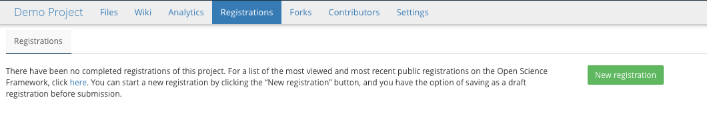
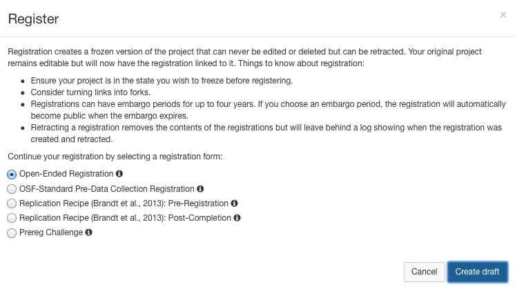
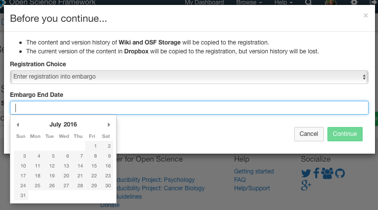
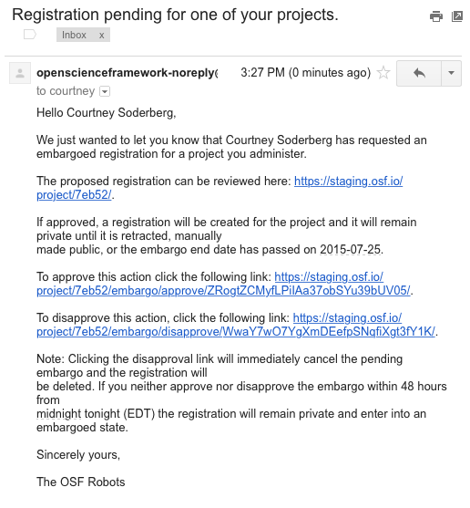
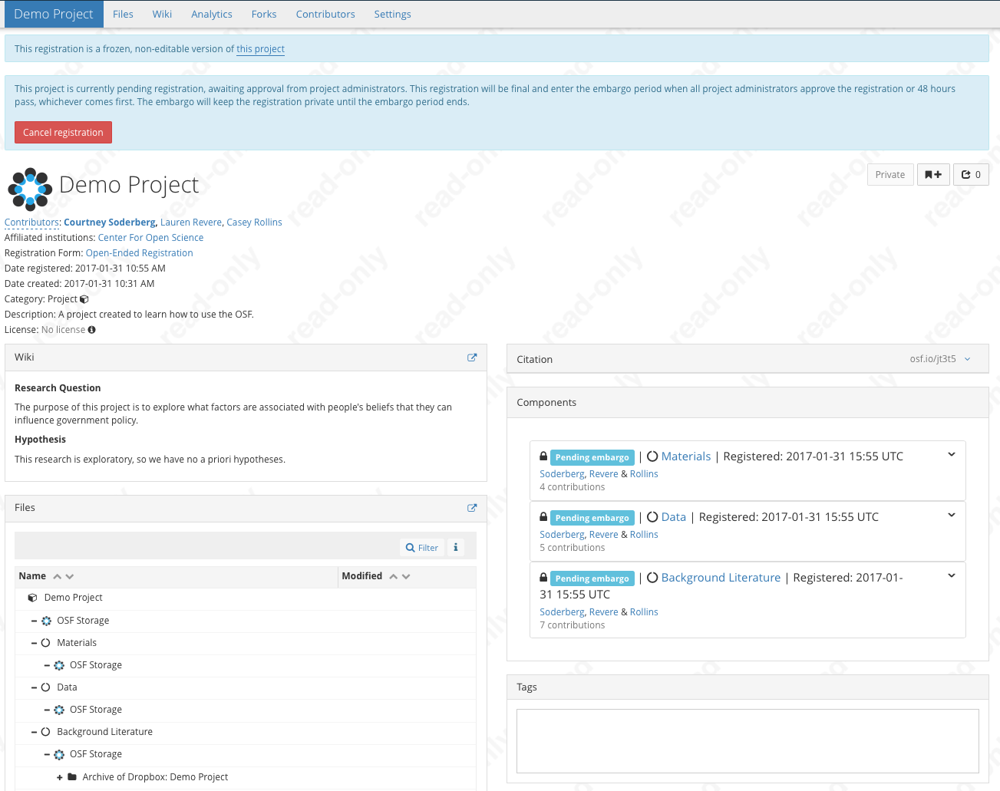

# Documenting as you go

## Learning objectives
* Understand how to effectively document ‘during the process’
	* Uploading files
	* Version control on the OSF
* Understanding the importance of certain lifecycle points
	* Creating Registrations
	* GUIDs/DOIs

# Section Outline
* A run through registration feature (warn participants that they should not follow along with this part)
	* discuss what a registration does

A registration creates a frozen snapshot of a project, or section of a project, that can never be deleted or changed. So basically, it’s a permanent, read-only copy of that part of the project.

	* discuss it’s use cases

A registration is a way to mark important points in the life of the project so you, and perhaps others, can easily go back and see what the project looked like at that point in time. Two particularly important points in a projects life that researchers may often want to register are the point right before data collection/analysis (often referred to as a pre-registation) and when a project has been completed and you are ready to share it with others, either through a publication and/or by openly sharing the data.

	* show the steps to register a project

I am going to show how you go about registering a project. Do **not** follow along with this section, as registrations are not reversible. The first thing you’ll need to do is click on the ‘registration’ tab on the top of the project. 

Note that the registration will contain the component you are currently in, and everything downstream of that component (i.e. everything nested within the component you’re currently in). 

This will take you to a page where you will register your project. There are a few different ‘registration templates’ that you can choose from. 

If you are unsure, just choose the ‘Open-ended Registration’ and this will give you the ability to provide some information about why you are registering the project. This is important, as you can have multiple registrations of a project and this section will allow you to tell them apart. 

	* show and discuss embargo feature

Another option you have is whether you want to make the registration public immediately, or place an embargo on the registration. If you place an embargo on the registration, this means that the project will be registered right now, but the registration will not be make public until some date up to 4 years in the future you specify. 

Why might you want to do this? If you are doing a preregistration, and your study hasn’t happened yet, you may want to embargo the registration so that participants and RAs cannot discover what you’re hypotheses are in order to preserve blinding in your study. Some researchers are also afraid of being ‘scooped’ and so they may not want to release their study protocol before the study is completed. If you are doing a a registration after a study has finished, you may also need the embargo feature because of the embargo policy of the journal you are submitting to, perhaps. All these are valid reasons. 

If you choose the embargo feature, an email will be sent to all the administrators on the project, asking if they want to cancel the registration. If any of the admins cancels the registration within 48 hours, the registration does not occur. If they all either approve it, or ignore the email, the registration goes through and the embargo period is set (this cannot be altered after the fact).

	* register project

Once the project is registered (either because you chose the immediate registration or because the embargo end data has passed) it will look like this. 

A few things to notice about the registration. Firstly, the registration GUID is different from the projects, so you can easily use the links to send people to either the project, or the registration, whichever is more appropriate. This is a picture of a registration that was made public immediately. You’ll notice that you can request a DOI/ARK ID for the registration. Especially if you are registering at the end of a project, the journal you a submitting to may require a DOI, and so registering the project is the way to get a DOI for the contents. 

* Person A uploads initial analysis script, Person B uploads data dictionary, Person C uploads data file(s)

So now that we’ve ‘registered’ our project, we can start the process of actually working on it. So, before, I had you all develop research questions. So, now, I’m going to give you a couple of minutes to actually work on creating materials to upload to the site. You’ll need a few things:

* Some documentation of the analyses you did. What exactly this is will depend on what program you are using to run your analyses. 

* A data file or data files. Think this through carefully. You have a few choices you can make. The first choice is what do to with the de-identified dataset. Additionally, if you are only using a subset of variables in your analyses, how do you want to upload your data? Remember that different components have differential privacy settings. There’s no real right or wrong way to do this, but at the end we’ll talk about the different choices people made and the pros and cons of the different possibilities. 

* A data dictionary.

So, take 5-10 minutes to work on creating these files and uploading them to your project. One person in your group should upload the data dictionary, another should upload the datasets, and another should upload the analysis documentation. You can upload files to the OSF in two different ways. The first is by simply dragging and dropping a file into the file tree, if the file is easily accessible on your computer. Another is to go into the files tab, click the ‘upload’ icon next to the component you want to upload your data to, and then this will bring up a widget to allow you to search through your computer to find the file you would like to upload.

* Showing version control
	* Person B edits person A’s analysis script so it includes comments
	* Person C edits the wiki to update is based on the analyses that were done

Alright, so now you have the static version of all these files, but in real research, things often change over time. We need a way to easily track those changes. We talked at the beginning how version control is important and how it often goes off the rails, making it really difficult to determine which files were actually used and to recreate the protocol and/or analyses. There are some programming languages out there that are specifically build for version control, many of you may have heard of Git and Github, and those are great, but they can provide a barrier to adoption of good version control methods for people who either don’t have the time, motivation, or ‘ability’ to learn how to use them. So, the OSF has built in basic version control features to help lower that barrier. 

Version control on the OSF works in a few different ways. Some things, you can edit directly on the site and save the new versions. This is a possibility for the wiki, and for anything that will render as a text file. So, if we go to the R script I uploaded, you’ll notice an ‘edit’ button in the top right corned if this is an editable file. I can click on that, and edit this script directly on the OSF, and the edits will be saved as a new version, the same thing with the wiki. For non editable files, the procedure is a little different. You’ll open the file on your personal computer, and make any changes that you want. Then save the file *with the exact same name* on your computer. So, on your computer, you’ve just over-written the file. Now, go to th e OSF and upload the file with the same name to the same component, once the file is uploaded you can click on that file  and see that there are now 2 versions of the file, and you can toggle between them. 

So, now that I’ve shown the ways version control works on the system, I want you all to edit your projects. Two of you, if you could go into the wiki and update it so that it reflects that analyses you actually performed. One of you who didn’t run the analyses, if you go could look at the analysis script that was uploaded, and edit it to make sure that it is clearly commented. How you do this will depend on the exact way in which the file was uploaded. If you don’t know how to comment in the particular language the analysis was done, ask the person who did the analyses.