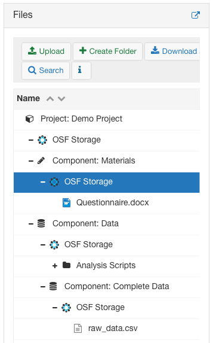
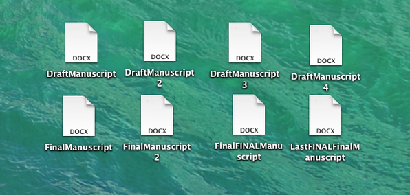
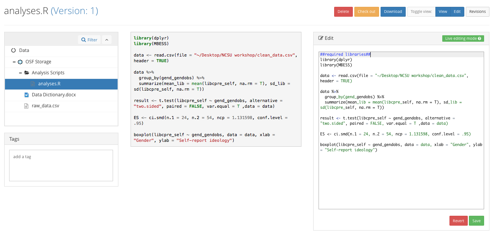
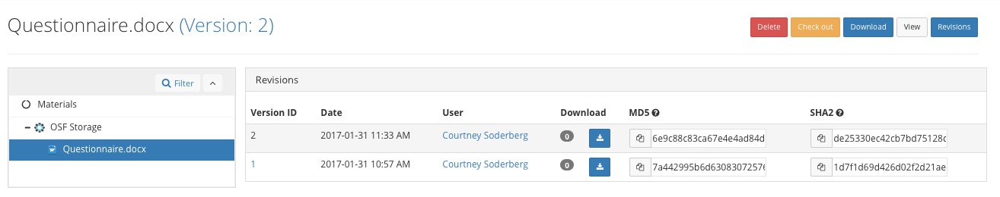

# Documenting as you go

## Learning objectives
* Understand how to effectively document ‘during the process’
	* Uploading files
	* Version control on the OSF
* Understanding the importance of certain lifecycle points
	* Creating Registrations
	* GUIDs/DOIs

## What is a registration?

So I mentioned that part of the point of documenting our research from the very beginning is so that we can track how the project changes across its lifecycle. One way to keep track of these important points is to create `registrations`. A registration is a frozen snapshot of a project, or part of a project. So basically, it is a permanent, read-only copy of a project from a particular point in its lifecycle.  Also, registrations may be embargoed but they will become public eventually - they can't remain private forever.

## Why register?

There are specific points in a project's life that may be particularly important to mark. For example, what the project looked like just before we started data collection (often called a pre-registration), or what the project looked like when it was accepted for publication are two points that we may want to easily be able to get back to, or share with others. Also, registration engages OSF's strong preservation services. All of the content from the project, even what is stored in add-ons, is packaged for long-term preservation.

## How do you register a project?

I am going to show how you register a project. Do **not** do this example because registrations are not reversible.  Just watch me.

The first thing is to click on the ‘registration’ tab on the top of the project. 

Note that this will register the part of the project you’re currently in, and all components and folders nested within this part of the project. 

Clicking register will take you to a registration page. There are a few different ‘registration templates’ that you can choose from that record some metadata about the registration.

If you are unsure which to select, just choose the ‘Open-ended Registration’. In the open-ended box, you can say why you are registering the project. This is important, as you can have multiple registrations of a project.  The description will help distinguish them.

Registrations must become public, but you can either make them public immediately or you can place them under embargo for up to four years. If you choose to embargo, the project will be immediately registered, but the registration will not be made public until after the embargo date that you specify. You can end an embargo early, but you cannot extend it further.

Why might you want to set an embargo? If you are doing a preregistration, and your study hasn’t been done yet, you may want to use an embargo so that others do not discover your work before you are done, and research assistants do not observe details of the design in order to preserve blinding in your study. If you register a completed study, you may also need an embargo to follow the policies of the publishing journal. 

Once you register a project, an email will be sent to all the administrators, asking if they want to approve or cancel the registration. If any of the admins cancels the registration within 48 hours, the registration does not occur. If they all either approve it, or ignore the email, the registration goes through and the registration becomes public or the embargo period begins.

Treat registration like publication, you can't go back.  If you do discover that you absolutely must go back - for example you posted proprietary data in your registration - then you have to retract the registration.  The retraction process will remove the content in the registration and replace with a notice of retraction.

Once the project is registered it will look like this. 

A few things to notice about the registration. Firstly, the registration GUID is different from the original project, so you can links directly to the project or the registration, whichever is more appropriate. For this registration, I chose to make it public immediately. Just like the actual project and registration have different GUIDs, they also have different privacy settings. So, even though the registration is public, the actual project is still private, and I can make changes to that project which non-contributors will not be able to see. Since this is a public registration, you’ll notice that you can request a DOI/ARK ID for the registration. DOI's are popular identifiers that are used frequently in citation of research products - like articles or datasets.  For embargoed registrations, once the embargo ends and they become public, you can obtain a DOI for them.

## Files and Version Control

Now we want to start actually working on our project. We had previously uploaded our materials, in this case our survey questionnaire, but now we need to make sure we upload our data. You always want to keep a copy of our complete, raw data file. Even if we end up doing a lot of data cleaning, or only using a subset of the datafile for our analyses, we want to keep a raw, untouched version of the data file to make sure we can always create our analyses from start to finish. So go ahead and name the data file accordingly and upload it to the appropriate section of you project. We also want to upload the data dictionary so we’ll always know what our variable names actually mean. 

> Activity: Upload raw data file and data dictionary.

Now we want to start actually working on the project. Before, I had you all develop research questions. I’m now going to give you some time to actually analyze the data to answer the research question you initially came up with. You can use whatever analysis software you like, just keep in mind that you need to document what you did, so you’ll either need to use a scripted language, like R or Python or SPSS or SAS and save the script so you can upload it, or write out a narrative description of what you did and upload that if you are using non-scripted software like excel. 

> Activity: Have groups takes a first stab at their data analysis and upload the documentation of their analyses. 

Alright, so now we have the static version of all these different files, but in real research, things often change over time. We need a way to easily track those changes. This tracking of different versions of a file is usually called ‘version control’. Often times people have their own ad-hoc version control procedures, such as:

This is a complete mess. Poor version control can make finding files and recreating experiments/analyses very difficult, because in a few months it may take days for you to figure out, if you can at all, exactly what protocol was used, or exactly which analysis file was used to produce the results in the paper you submitted. We want to make sure this doesn’t happen to us. 

There are some programming languages out there that are specifically built for version control, many of you may have heard of Git and Github, and those are great, but they can prove to be a barrier to adoption of good version control methods for people who either don’t have the time or motivation to learn how to use them. So, the OSF has built in version control in an accessible way to help lower that barrier. 

Version control on the OSF works in a few different ways. You can edit directly on the site and save the new versions. This is a possible with the wiki, and for anything that will render as a plain text file. So, if I go to the R script I uploaded, you’ll notice an ‘edit’ button in the top right corner. I can click on that, and edit this script directly on the OSF, and the edits will be saved as a new version, the same thing with the wiki. 

For non-text files, the procedure is a little different. You’ll open the file on your personal computer, and make any changes that you want. Then save the file *with the exact same name* on your computer. So, on your computer, you’ve just over-written the older version of the file. Now, go to the OSF and upload the file with the same name to the same component, once the file is uploaded you can click on that file  and see that there are now 2 versions of the file, and you can toggle between them. 

Now that I’ve shown the ways version control works on the system, I want you to edit your projects. Two of you, please go into the wiki and update it so that it reflects that analyses you actually performed. One of you who didn’t run the analyses, please look at the analysis script that was uploaded, and edit it to make sure that it is clearly commented. How you do this will depend on the exact way in which the file was uploaded. If you don’t know how to comment in the particular language the analysis was done, ask the person who did the analyses.

> Activity: update wiki to reflect analyses done & clearly comment analysis scripts

The final thing we want to do is make sure that we give our future selves and, potentially, other people information about how to navigate our project. So, what are our files, where can we find things, if information is missing or private, why? Basically, we want to create a README for the project. We’ve already done a bit of this by putting information about the research question for the project in the wiki. But, we also want to add information there, and/or in the wikis of our subcomponents about what files are there and how to navigate through the project. 

> Activity: update wiki to include navigational README for the project
