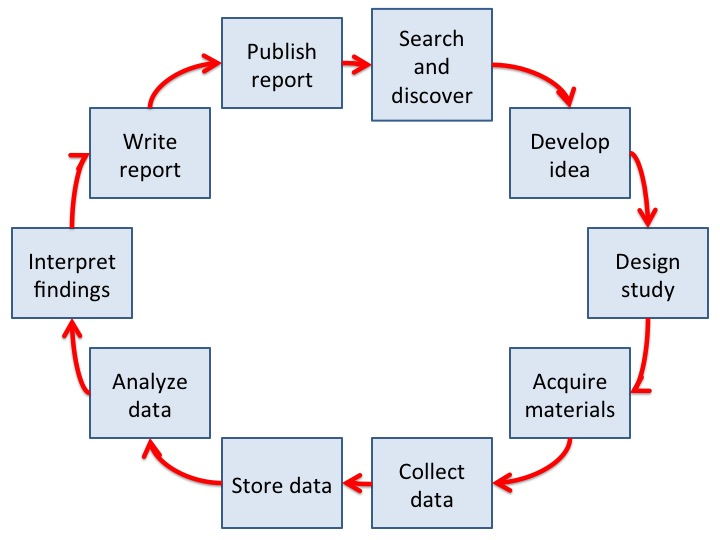

# Introducing the Problem

## Learning objectives
* Understand the current issues and barriers to reproducibility
* Understand how the complete scientific workflow can affect reproducibility
* Understand documentation/organizational issues underpinning reproducibility 

## What is the problem?

Researchers often have three broad goals for their work. The first is that they are interested in studying innovative ideas and want to discover new things about how the world works. Second, they are interested in producing reproducible results; they want to be able to find their results again, and they want others to be able to find them as well. Finally, researchers want to build off both their own and the work of others in order to accumulate knowledge over time; they want research to move our understanding of the work forward. 

All three of these ideals are supposed to be embodied in the published, peer-reviewed scientific literature – the place where scientific knowledge is accumulated and built upon. We want to believe that the published literature embraces these three ideals of novel discoveries, reproducibility, and tracking the accumulation of knowledge. However, over the past few years there has been increasing concern that many research findings across fields (e.g. cancer biology, psychology, and political science) in the published literature may not be as reliable as we would hope. Though there have been several high profile fraud cases the last several years, this is typically not a widespread problem. What we will talk about today are standard research practices that lead scientists to produce research that is more difficult to reproduce and replicate, thus leading to generally low levels of replicability. 

## What is Reproducibility?

Before we go any further, I want to define what I mean when I say reproducibility. This is a broad term that has been used by many different people to mean different things, so I want to make sure we’re all on the same page. 

####Computational Reproducibility
One way in which a study can be reproducible is if you took a researcher's data and code/analysis scripts and reran exactly what they did, you would be able to reproduce the same numbers that have been reported in their research paper. This is sometimes called `computational reproducibility` and might sound rather simple, but can be surprisingly tricky to achieve. For example, the Quarterly Journal of Political Science requires that all submitted articles also submit a ‘replication package,’ which includes all the data and code required to replicate the numbers mentioned in the articles. These are then subjected to internal review. Over the last two years, 14 of the 24 empirical papers, or 58 percent, subjected to this review showed differences between the results reported in the paper and the results obtained from the internal review.

####Empirical Reproducibility
Another type of reproducibility is the question of whether we can reproduce what was done. So, do we have enough information to rerun the experiment or survey the way it was originally conducted? This is sometimes referred to as `empirical reproducibility`.

####Replicability
Finally, there is the question of whether we have enough information to completely reproduce the study's protocol, the analyses, and run them on an independent data set. Would we come to the same statistical conclusions as the original study? This is often referred to as the `replicability` of the study.

All three of these points are important, and you’ll notice we can’t even attempt the third type without the first two types. We want the results of studies to be reproducible and findings to replicate. For this workshop, we will be talking about things you can do that help increase all three types of reproducibility with the end goal of making scientific studies more reproducible and findings more replicable.

## What is leading to low levels of reproducibility?

I mentioned earlier that when we talk about issues of reproducibility, we aren’t talking about fraud. So if the lack of reporoducible research is not caused by fraud, what is leading to the problem? There are a number of contributing factors, but one of the big issues is a lack of documentation and transparency. Here is an abstract representation of the research lifecycle. 

According to the research lifecycle, if I’m not in your lab, the only part of this process that I can see is the final step; the published report. Even if I am in your lab, after about 6 months, I probably won’t remember what happened at these various steps anyway. So, again, all I will be left with is the published report. Similarly if it is my own research, I will at some point probably forget many of the details of those earlier steps and have to resort to using the publish report as a guide. Using only the published report to draw conclusions can create several problems. Firstly, published reports are often lacking specific details, so it can be very difficult to determine exactly what was done based solely on the information in the published report. Secondly, the published report often doesn’t give us an indication of how the research question, methodology, or analysis strategies may have changed over time. The evolution of these protocols can give us important information for evaluating the conclusions of the research. Thus, not documenting and being transparent about the entire research process is problematic. Finally, currently there is a large bias against publishing non-statistically significant findings. This leads to a large ‘file drawer’ effect, where many studies don’t get published, making it difficult to accumulate certain types of knowledge. If we better document the overall process of all research studies, not just published ones, this will help give us more accurate information about the breadth of research being conducted. 

## Why should you care about increasing reproducibility?

Low levels of reproducibility and replicability are a problem for a number of reasons. One you may already be familiar with is that if findings of studies don't replicate, this may indicate that we don't have the knowledge we think we have. If we can’t reproduce the experiments that means we also can't check to see if the results will replicate. This makes it difficult to attempt to validate scientific knowledge, as it slows down the progress of science and potentially leads to wasted resources and poor decision making based on potentially non-replicable lines of research.

Low levels of reproducibility also have an impact closer to home. Specifically, it can make the work in your own lab less efficient. Labs are transient; one graduate student starts a project, leaves, and another graduate student tries to pick up or extend upon their project. Or perhaps you submit a paper for review. 6 months later the editor asks you for new analyses, so you have to search for your data and analyses again. Both scenarios are contingent on knowing where all your research is and being diligent about the transfer and organization of knowledge within your lab. In general, researchers don't do this well at the moment, therefore our current practices make it hard for us to replicate and build off our own work, often leading to a waste of time and lab resources. 

Current best practices to address some of these issues include physical or electronic lab notebooks used by members of the lab to document data collection, ideas, possible dead-ends... basically anything that goes on in the lab. Lab notebooks are great, we encourage their use, but they only address some of the issues that you'll learn about today. 

Learning about and implementing more reproducible practices will help both your own work and science as a whole. 

## What will happen in this workshop?

In this workshop, we will be talking about ways to increase the documentation and transparency of your workflow along with learning about tools that can help you implement these changes. To accomplish this, we will be working through an example research study in simulated research groups that contain a PI, graduate student, and research assistant. Collectively, you’ll work on building an open, transparent research project from start to finish in order to learn good project management practices while using the Open Science Framework (OSF). At the end of the workshop we will also share the projects we’ve built so that we can see how well others understand the work we have done. 

## Group set-up
To start off, let's count off in 3s. If you don’t have a computer with you, say ’skip’ and look on with one of the groups on either side of you. These will be your groups. All the 1s will be PIs, all the 2s will be graduate student collaborators, and all the 3s will be research assistants. Don’t worry too much about your role, as it will not have a huge impact on what you do today, but if you feel uncomfortable in your role and you want to switch with someone else in your group that is fine.

> Activity: Count off in 3s for group creation

Also, as I mentioned we will be working with the OSF during this workshop. If you don’t already have an OSF account, please go ahead and set-up one. If you go to [visit OSF](https://osf.io) you can either create an account, or sign-in if you already have one. If you are creating an account, an email will be sent to your email to verify your account.

> Activity: Sign-up or login to [visit OSF](https://osf.io)

