# Setting up a collaborative space

## Learning objectives
* Understand how to set up a centralized location for project storage/management
* Understand the purpose and use of the wiki
* Understand how the different ways folders and components can be used to organize a project

## Materials Overview
Hopefully you all had a chance to skim over some of the files I emailed to you yesterday. The files are a small subsection of materials from the 2012 Annual National Election Survey in the US, which we will be using as our example materials for today's
workshop. Don’t worry, you don't need to know anything about US politics or elections; it is simply a dataset that can be easily understood no matter what your scientific discipline or level of experience is. It will allow all of us to collaborate even if you are in a group with people from a variety of scientific fields. 

I emailed you the materials this morning. If you open up the filed called, ‘Questionnaire’, you’ll notice that there are about 12 different questions that respondents were asked to answer were (this is a very small subsample of the questions from the actual survey). Over the course of this workshop, each group will decide amongst themselves, from the available materials, what their research question will be, variables they want to use, analyses they want to perform, how they want to build and structure their project, and how open they would like the project to be at the end. 

## Creating a project

We talked before about some problems that can arise when we either don’t document our work or we try to back track and document our work after a study is accepted for publication. This becomes even more challenging when you have multiple collaborators, often times at different institutions, who send materials back and forth by email. What you frequently end up with is a very distributed network of materials, with some documents on your computer and Dropbox or different versions of files in various email threads. This makes it difficult to recreate your workflow or find particular files. In order to begin to solve some of these problems, we will use the OSF to set up a collaborative space. This will help us document and organize our research study in a centralized location.  

Now that you are all signed in, you should see the `project dashboard`. This is where you will start each new `project`. A `project` on OSF can be anything: a lab group, an organization, a grant, a line of research, an individual experiment, etc. Think of your project as the top level of a nested structure. You’ll be able to nest as many things under it as you like. Different researchers and labs may have certain preferences about what they choose as their top level project. 

Since we don’t have any projects yet will be only working on one research project, let's create a project for that one study. If you are the PI in your group, please click on the ‘create project’ button and give the project whatever title you choose. If you would like to give the project a short description you may, but there will be space later to add a longer description. Go ahead and create the project:

> Activity: PIs create new project

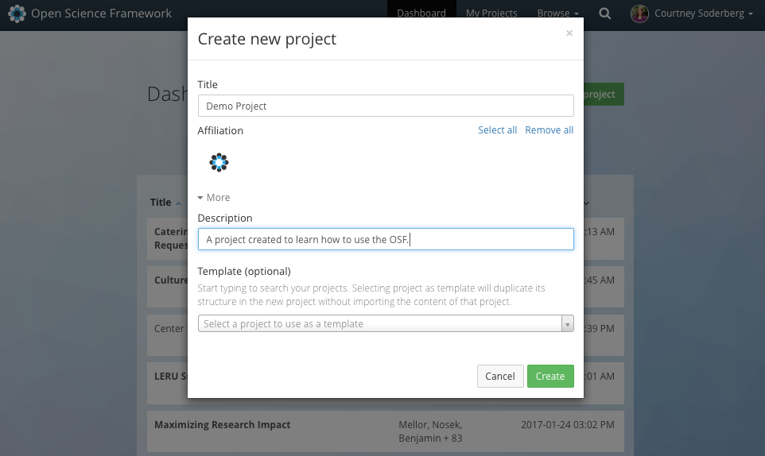

If you are a PI, you should now see something that looks similar to my screen. If you aren’t a PI, you can follow along on my screen for the moment. This is the `project overview page`. Any project you create on the site will start out looking similar to this. You can then customize it to fit the needs of your particular project or workflow. The system was built to be very discipline agnostic, which is why projects start out so bare. 

The `project overview page` has a few different sections. The `wiki` is a collaborative editing space that you can use to include important overview information about the project, including things like READMEs, abstracts, research questions, outlines, etc. The `file tree` is how you upload and navigate to files in the system; most file types are accepted such as CSVs, Word documents, PowerPoint slides, PDFs, and image video files. The `component` section is how you add additional structure and nesting to your project (we will talk more about this later). You will also see the `citation` widget, which displays the automatically generated citation for the project:

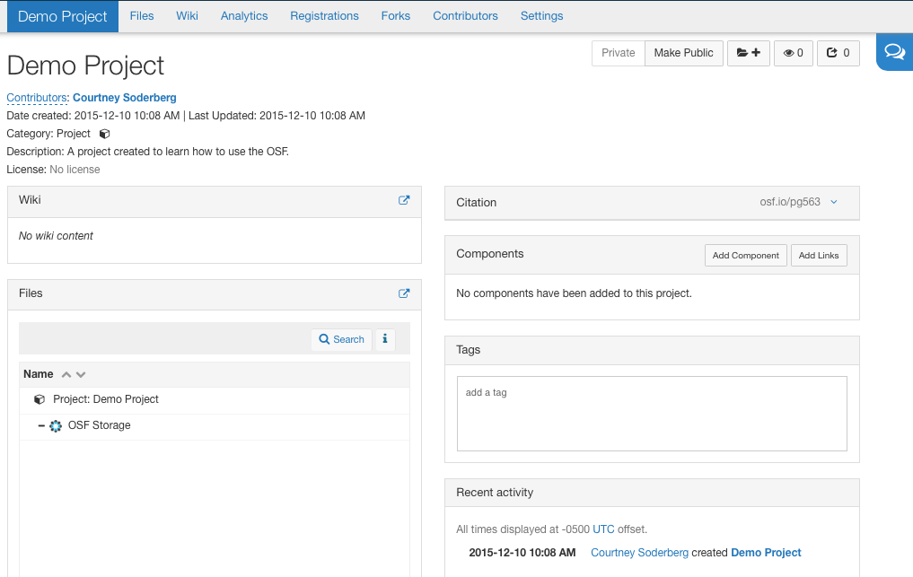

In your brower's search bar, you will notice a 5 letter string at the end of the osf.io url. This entire web address is a GUID, or a 'Globally Unique Identifier.' This permanent, unique identifier has been assigned to this project page and will always point back to it unless the project is deleted. 

## Giving contributors access

If you are the graduate student or RA in your group, go ahead and type in the GUID of the project your PI created.

> Activity(Question): What are GS & RAs seeing after typing in GUID?

If you aren’t a PI, you should see a screen that says you don’t have access to the project. This occurs because all projects on the OSF are set to `private` as a default. As such, only people who have been added as `contributors` to the project have access to it and can see and/or edit it. On our example project, the PI is so far the only contributor because he/she created it.  Since we want this to be a collaborative project, we need to give the other two members of your team access to the project as well. The way you add your team members as contributors is by going to the `sharing` tab and clicking. 

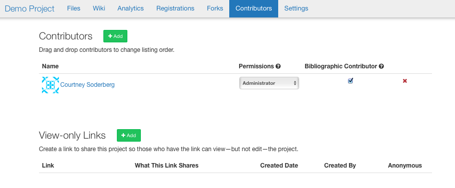

Here, I can search for people who I want to add as collaborators, then click the + icon to add them to the project. 

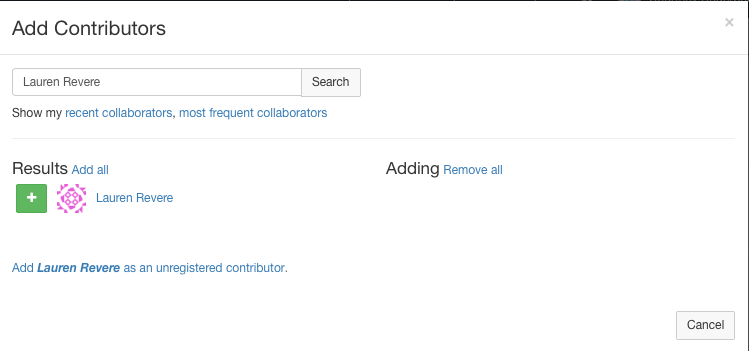

You will notice that each person is given a specific permission setting for access to the project. There are three possible settings, `admin`, `read + write`, and `read`. Read access means the contributor can see into the project and download any files they want, but they will not be able to add files or modify content. Contributors with Read + Write access have additional capabilities to add and modify files, but they cannot change any of the settings on the project. For example, they cannot add new contributors or change the privacy settings on the project. Administrator access allows a contributor to do anything with the project and files. I can assign different permission settings to different contributors if I need to.

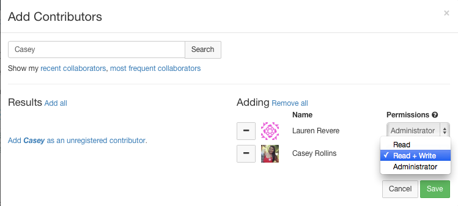 

PIs, go ahead and add your graduate student and RA collaborators to your project. You can decide what level of access you want to give them, but keep in mind that later on both will need the ability to upload files.

> Activity: PIs add other groups members as contributors

Grad students and RAs, if you try the GUID again, you should now be able to see the project page. Does everyone see their project page?

If we now go back to the project overview page, you’ll notice that all three people are listed as contributors on the project and they are also listed in the auto generated citation for the project.

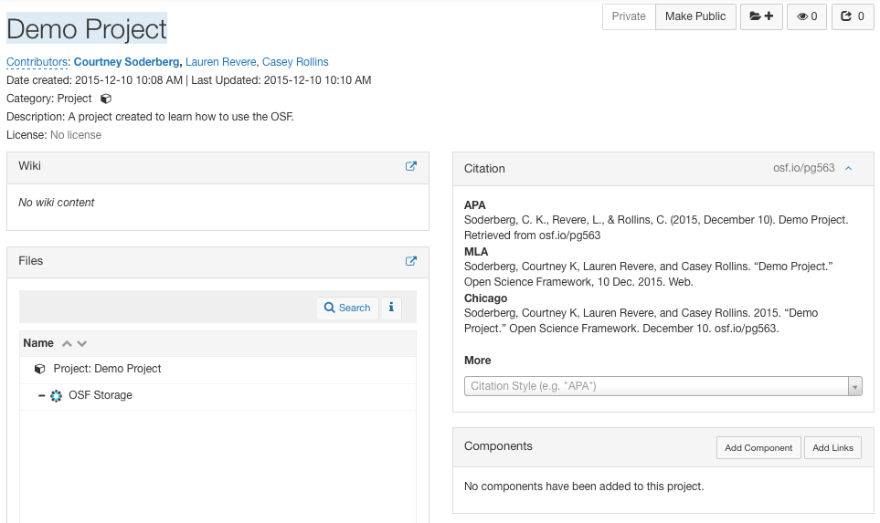

If you wanted to give someone access to your project but did not want to give them authorship credit, you can do this via the 'sharing' tab as well. Perhaps your RA needs access to your project but you typically give your RAs acknowledgements rather than authorship; you can uncheck the ‘bibliographic contributor’ box next to that person’s name on the 'sharing' page.

## Creating a wiki

Now that you have created a project you and your group members can access, the next thing to do is to write down some information about the project - such as the purpose of the project, our initial research question, etc. As the project evolves over the course of the research lifecycle, documenting this information upfront will make it easy for us to always go back and see how the project started out. Depending on how exploratory or confirmatory the study is, this section can also start out pretty loose or very detailed. On the OSF, a good place to put this type of information is in the wiki. The wiki is a real-time, collaborative editor, meaning your whole group can work on it at once. It can also be formatted using markdown if you want to get fancy. Access the wiki by clicking on the widget and then clicking on the ‘edit’ button in the upper right corner. This will open up the text editor. 

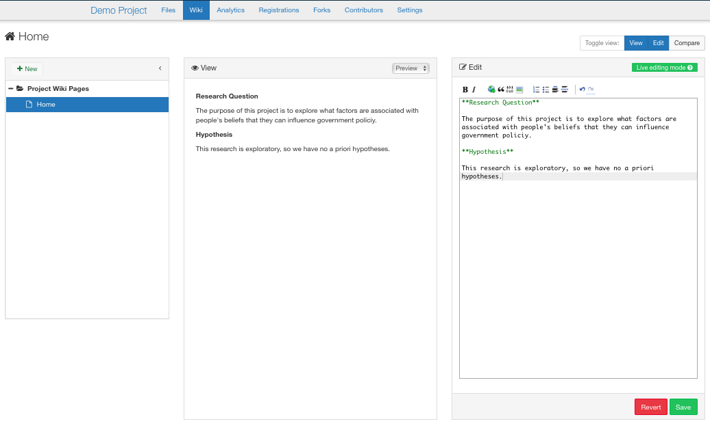

Let's have you take a minute to set up a wiki for your project. Take a few minutes to discuss amongst your group what you are interested in looking at with regards to the ANES dataset I gave you. Then, collaboratively enter in your research question and hypotheses (if you have them).

> Activity: Create wiki with RQ and hypothesis

## Adding organizational structure 

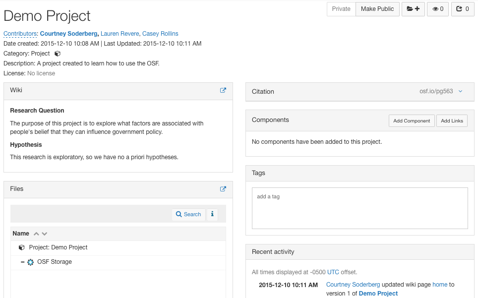

Right now our project is pretty flat. It is basically one big folder with some basic content entered in the wiki. For most projects, we will want to create structure by adding sections to organize related files. For example, we might want to organize all our data files together and keep those files separate from protocols or study materials. If we had set up a project for a lab group or an institution, you might have separate sections for each person in the lab, or each line of research. On the OSF, You can do this in two ways depending on your preference. The first way to add structure to a project is to add `components`. You do this by clicking the `add component` button on the right of your screen. You can name the component whatever you want (materials, data, protocol, IRB, etc.) and you can also choose a category. 

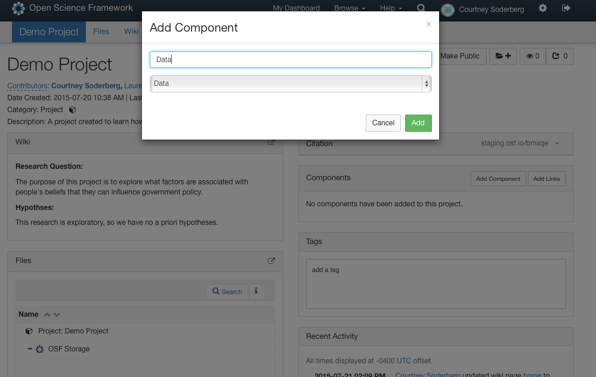

Once the component is created, we see that its structure is the same as the higher level project we created earlier. Components have their own file trees, wikis, contributor lists, and privacy settings. We can also nest components within components. Components are a way to organize different types of files in a project, while also allowing you to set up areas that have different privacy settings or contributor lists from other sections in the project. This can be important for having fine grained control over access to different parts of a project.

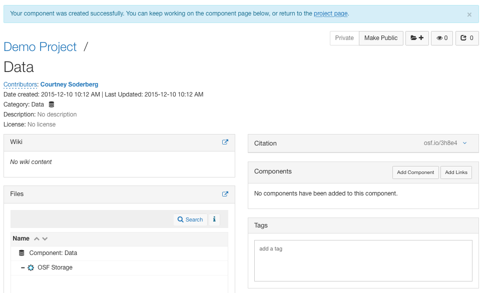
		

Folders are another organization option that function differently than components. A folder is simply a way to group files. If we click on the OSF storage icon you’ll notice that a `create folder` button will appear. 

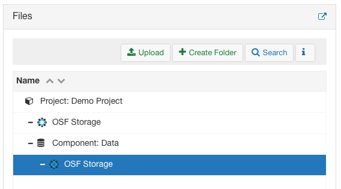

We can name this folder what ever we like. 

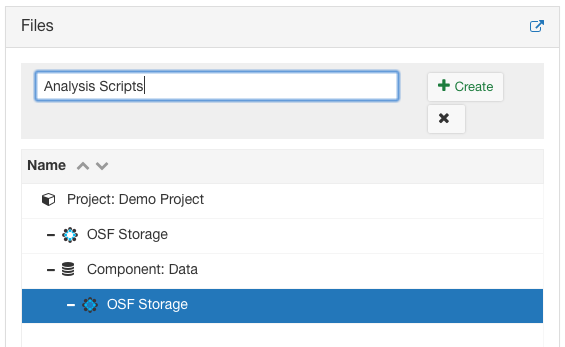

If you click on the folder, it will only expand - you won’t be taken into the folder and it doesn’t have a wiki or it’s own access settings. Access settings are the same as the project/component it is nested under. Therefore, folders help organize files, while components help set up large sections of a project.

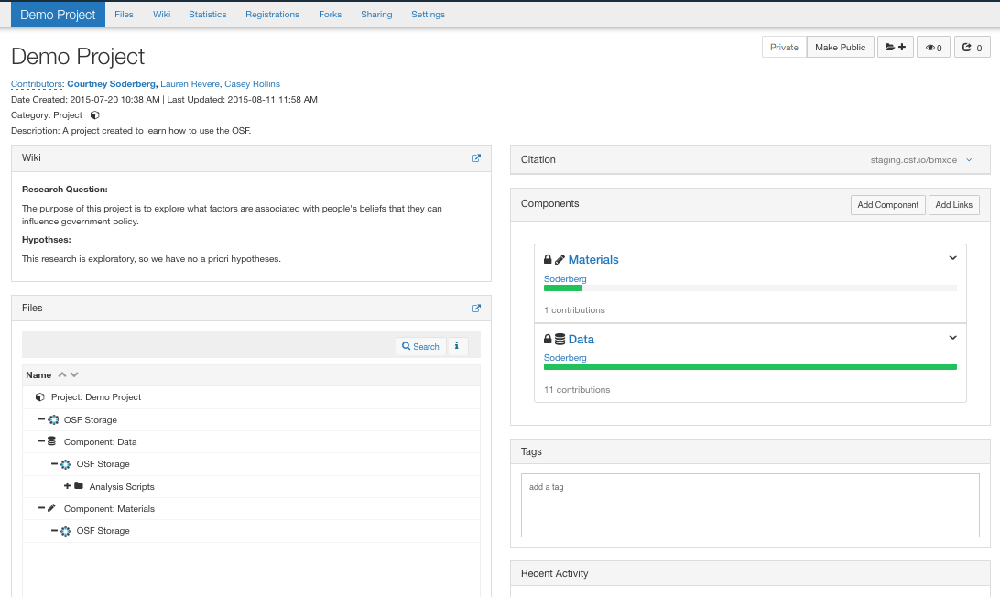  

Now that I’ve explained the difference between components and files, we can work on giving our projects some structure. There are no right or wrong ways to set up your project, and you can always rearrange things later on if you determine a better way to organize your work. Think through the major categories of file types you might have (i.e. hypoetheses, methods, data), and whether you might want to toggle the public/private settings (i.e. perhaps you only want to make your hypotheses and methods public). You can also change your contributors' access (i.e. you may want your RA to have only read access to your data). Finally, determine whether you want to set them up as folders or components.

> Activity: Create project structure using folders/components
