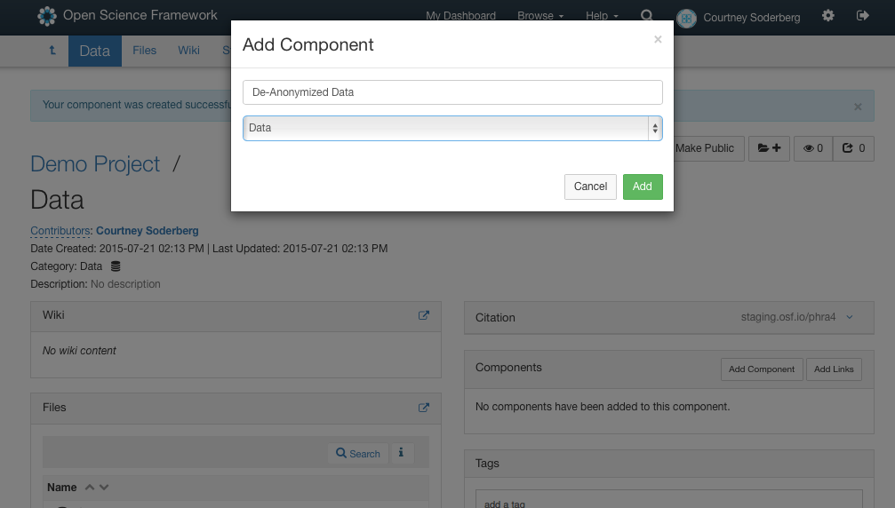

# Setting up a collaborative space

## Learning objectives
* Understand how to set up a centralizer location for project storage/management
* Understand the purpose and use of the wiki
* Understand use and importance of subfolder/subcomponent organization

## Group Set-up
For most of the workshop, you’ll be working in groups of three to simulate a research project with a PI, graduate student, and research assistant. Collectively, you’ll work on building an open, transparent research project from start to finish in order to learn good project management practices and use of the OSF. So, to start off, lets count off in 3s. If you don’t have a computer with you, say ’skip’ and look on with one of the groups on either side of you. These will be your groups. All the 1s will be the PIs, all the 2s with be graduate student collaborators, and all the 3s will be research assistants. Don’t worry too much about your role, it’s not going to have a huge impact on what you do today, but if you feel uncomfortable in your role and you want to switch with someone else in your group that is fine.

Hopefully you all had a chance to skim over some of the files I emailed to you yesterday. These are a very small subsection of materials from the 2012 Annual National Election Survey in the US, which we’ll be using as our example materials for the workshop today. Don’t worry, you won’t need to know anything about politics or US elections; it’s just a dataset that can be easily understood no matter what your scientific discipline or level of experience, so it should allow us to all collaborate even if you’re in a group with people from very different scientific fields. 

I emailed all the materials to you this morning. If you open up the filed called, ‘Questionnaire’, you’ll notice that there are about 12 different questions that were asked of respondents (this is a very small subsample of the questions from the actual survey). So, over the course of the workshop, what is going to happen is that each group will decide amongst themselves, from the available materials, what there research question will be, the variables they want to use, the analyses they want to do, how they want to build and structure there project, and how open they would like the project to be at the end. 

## Creating a project

We talked before about the problems that can arise when we either don’t document work, or we try and go and back document work once a study is accepted for publication. We also talked about the challenges and problems that can arise when we are trying to collaborate with multiple people. So, to try and begin to solve some of these problems, we’re going to set up a collaborate space for our research study using the OSF to help document and organize our research.

To start, we need to go to osf.io. If you don’t have an account already go ahead and take a minute to create one, or sign-in if you already have an account. 

Now that you’re all signed in, you should be all be seeing the `project dashboard`. This is where you start each new `project`. A `project` on the site can be anything: a lab group, an organization, a grant, a line of research, ann individual experiment, etc. Basically, you can think about this as just the top level of a nested structure. You’ll be able to nest as many things under it later as you like. So different researchers and different labs will have different preferences about how high level they like initial projects to be. 

### Activity
Since we don’t have any projects yet, and we’re only going to be working on one research project, lets just create a project for that one study. If you are the PI in your group, if you could click on the ‘create project’ button, and give the project whatever name you like. You can also give it a short description if you want, but you don’t have to. There will be a space later to add a longer description. Then, create the project:

If you’re a PI, you should now be seeing something that looks similar to my screen. If you aren’t a PI, you can follow along on my screen for the moment. This is the `project overview page`. Any project you create on the site will start out basically looking like this, and then you can customize it to fit the needs of that particular project or workflow. The system was built to be very quite discipline agnostic, which is why projects start out so bare. 

The `project overview page` has a very different sections. The `wiki` is a collaborative editing space that you can use to include important overview information about the project, things like READMEs, abstracts, research questions, outlines, etc. The `file tree` is how you upload and navigate to files to the system; you can upload basically any type of file that you want, everything from CSVs to word documents, to power points, to image and video files. The `component` section is how you add additional structure and nesting to your project, we’ll talk more about that later, and then there is the `citation` widget, which shows you the automatically generated citation for the project:

At the top of the screen, you’ll notice a little 5 letter string at the end of the osf.io url. This entire address is a GUID, or a permanent, unique identifier. This address has been assigned to this project page and will point back to it unless the project is deleted. 

## Giving contributors access

### Activity
If you are a acting as a graduate student or RA in your group, go ahead and type in the GUID of the project your PI created. What happens? 

If you aren’t a PI, you should be seeing a screen telling you that you don’t have access to the project. That’s because all project on the OSF are set to `private` as a default. This means that only people who have been added as `contributors` to the project have access to it and can see and/or edit it. Right now, the PI is the only contributor on the project because they created it.  Since we want this to be a collaborative project, we need to give the other two members of your teams access to the project. If you go up to the `sharing` tab and click on that, this is how you can add people as contributors.

I can search for people who I want to add as collaborators, then click the + icon to add them to the project. 

You’ll notice that each person is given a permission setting for access to the project. There are three possible settings, `admin`, `read + write`, and `read`. Read access means the contributor can see into the project and can download any files they want, but they will not be able to add any files or modify any content. Contributors with Read + Write access have additional capabilities to add and modify files, but they can’t change any of the settings on the project (so for example they can’t add new contributors or change the privacy settings on the project). An administrator can do anything to the project and files. I can assign different permission settings to different contributors if I need to.

 

### Activity
PIs, go ahead and add your graduate student and RA collaborators to your project. You can decide what level of access you want to give them, but keep in mind that later on both are going to need the ability to upload files.

Grad students and RAs, if you try the GUID again, you should now be able to see the project page. Is everyone seeing their project page?

If we now go back to the project overview page, you’ll notice that all three people are listed as contributors on the project, and that they are all now also listed in the auto generated citation for the project.

If for some reason you wanted to give someone access to the project but did not want to give them authorship credit, perhaps your RA needs access to the project but you don’t generally give your RAs authorship, just acknowledgements, you can do this by going back to the ‘sharing’ screen and unchecking the ‘bibliographic contributor’ box next to that person’s name.

## Creating a wiki

Now that you have a project and everyone has access, the first thing to do is start to write down a bit of information about the project. This will often start out pretty loose, depending on how exploratory vs. confirmatory the study is, and over time turn into something more detailed like an abstract and/or a README file of the project. On the OSF, a good place to put this type of information is in the wiki. The wiki is a real time collaborative editor, so your whole team can work on it at once. It also can be formatted using markdown. You get into the wiki by clicking on the widget, and then click on the ‘edit’ button in the upper right to open up the editor. 

	* Person B starts, person A & C add content 
		* research question & hypothesis to start out with

Lets have you all take a minute to set up a wiki for the project. So, collaborative set up a wiki that includes the research questions you’re interested based on the data you have, and any hypotheses you might have about what you will see.

## Adding organizational structure 

	* Explain components vs. folders and demo making one versus the other
		* components have all the same functionality as projects (wikis, their own contributor settings, their own public/project settings)

Right now our project is pretty flat. It is basically just one big folder with a wiki with some basic content in it. For most projects, we’ll want to add some structure and add sections, so example some way to collect all the materials related to data together, or a way to collect all the files related to our protocol together. If we had set up a project for a lab group or an institution, you might imaging having separate sections for each person in the lab, or each line of research. You can do this in two ways on the OSF depending on your prefer. The major way to add structure and sections to a project is to add components. You do this by clicking the ‘add component’ button on the right of the screen. You can name the component whatever you want (materials, data, protocol, IRB, etc.) and you can also give it a category, though you don’t have to. 

Once the component is created, we can go into it and see that the inside of all components looks just like an empty project; they have their own file trees, wikis, contributor lists, privacy settings, and we can even nest components within components. So, components add structure, but they also allow you to set up areas which have different privacy settings or contributor lists from other sections in the project, which can be important for controlling access. 

You can also nest components within other components if you need to create even more specific categories of files with their own wikis and permission settings.

		
		* folders are just ways to organize files, have no other functionality

Folder on the other hand are a little bit different. A folder is literally just a way to group a set of files, nothing more. So, if we click on the OSF storage icon you’ll notice that a ‘create folder’ button will appear. 

If we do this, a folder will appear which he can then name whatever we want. 

However, if you click on the folder, it will just expand; you won’t be taken into the folder and it doesn’t have a wiki or it’s own access settings; the access settings are the same as the project/component it lives within. So, folders are just about organizing files together, while components are good for setting up large sections of a project.

  

	* Have participants collectively create structure for their project however they like

Now that I’ve explained the difference between components and filers, I’ll give you a bit of time to set up some initial structure for your project. You can set it up however you want, there isn’t necessarily a right or wrong answer. Also, don’t worry, you can always move things if you initially set it up in one way and your realize that it would be better to set it up in another way later on. Just think through what are the major categories of file types you’ll have, and whether you might want to have different contributors or public vs. private access setting for them to determine whether you want to set them up as folders or components.
