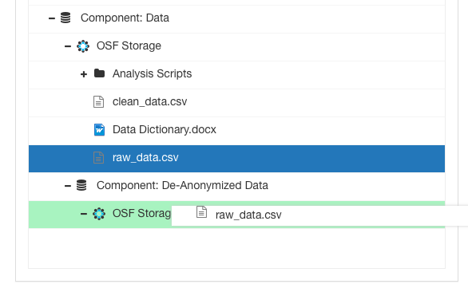
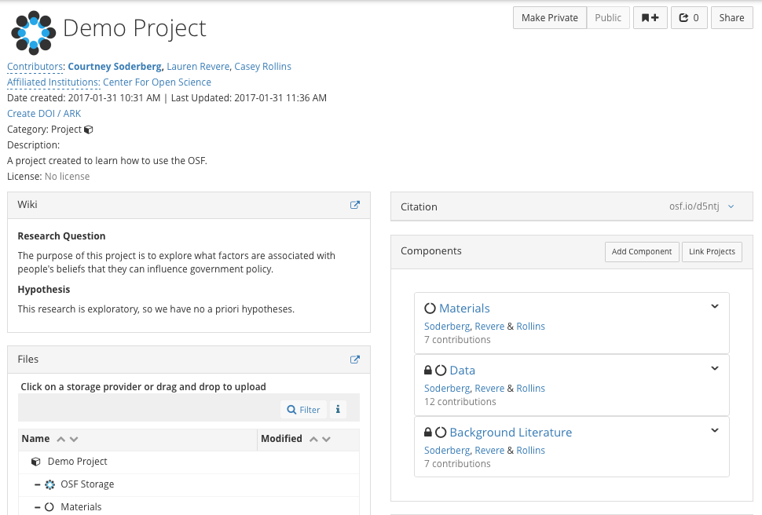
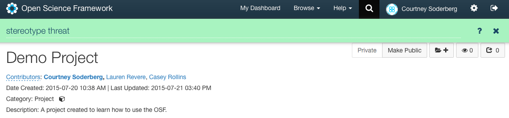
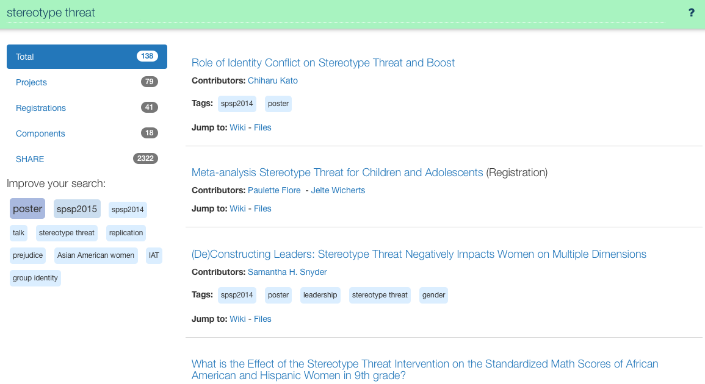
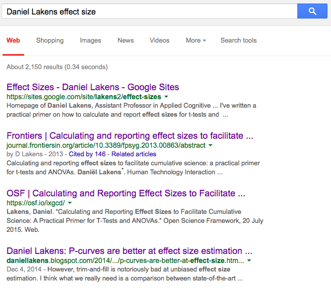
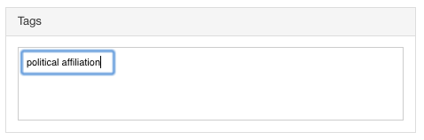
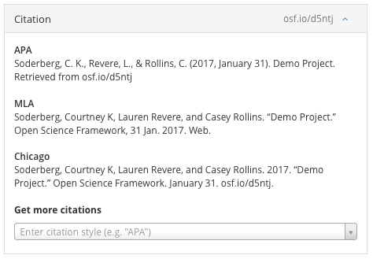
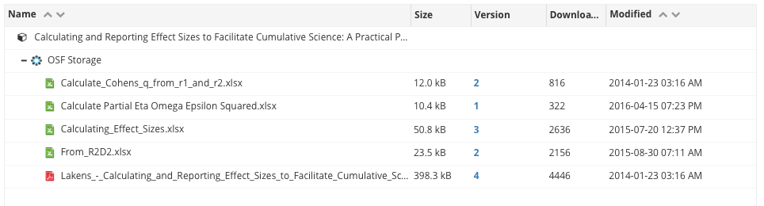
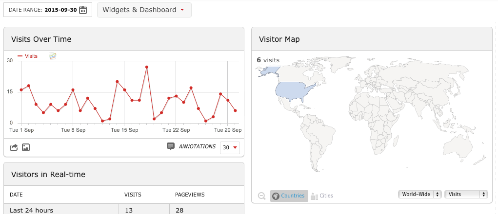

# Sharing your Work

## Learning Objectives
* Understand the motivations for open sharing
* Understand important considerations before making data public
* Understand how to make your research discoverable	
* Understand how to get credit for your work

## Why share?

Now that we have created our project, uploaded all the materials, and documented our workflow, we need to decide if we want share our work, and if so what parts of it do we want to share? There are many different reasons why you might want to share your work. 
* Many journals and funders now require that data and code be shared upon publication or at the conclusion of a grant. 
* There is evidence to suggest that papers with open data get cited more often than papers that do not. (see [Piwowar et. al., 2007](http://journals.plos.org/plosone/article?id=10.1371/journal.pone.0000308))
* Sharing materials and data make it easier for others to try to reproduce and build off your work. 
* Openness is inherently tied to reproducibility. If other researchers disagree with your work, the onus is on them to find the flaws.

Therefore, there are both internal and external reasons that may motivate researcher to share some or all their research.

## Sharing

As was previously mentioned, everything on the OSF is private by default. You can make the entire project and/or subproject or components of the project public at any point by clicking the `public` button on each project/component page. Now that we are finished with our research study, we need to decide how much information we want to make public. One important thing to consider before making any information public is whether it contains sensitive data that cannot be made public for legal or ethical reasons. This might include materials that are copyrighted, files that contain identifyin information, or datasets that you can only make public after anonymizing the data per your IRB.  It is important to organize our project in a way that we make public only the parts we want, while keeping other parts private as necessary. 

As you may recall, I mentioned that our datafile has geotags, so we can’t make the raw_data file public. We’ve already created a anonymized (or ‘cleaned’) data file, which we can make public. But right now I have both files in the same ‘data’ component, so I can’t make one public and keep the other private.

> Activity (Question): What could I do so that I could share my clean data file but not reveal my raw data file with the geolocation variable in it?

One thing I could do would be to create another component under `Data` and move my raw data file to that component. Any file can be moved by simply clicking and dragging it to whichever part of the project you want to move it to. 

> Activity: Now that I’ve shown you how to move files, discuss how much of your project you can/want to make public. Make those sections of your project public, and if you need to reorganize any parts of your project to accomplish that, please do that now.

## Increasing discoverability
 
All projects, subprojects/components, and files on the OSF have GUIDs. If I want people to be directed to my project I can send them the specific GUID  or put it in my paper to help people easily navigate to my materials. In addition, we also want our work to be disoverable to others who don't know it currently exists. 

Work posted on the OSF can be discovered in several ways. The first way is through the search function found on the OSF. We can search for anything we want such as a project title, general topic or person’s name, and the system will bring up anything related to our search.  

You’ll see it will also make suggestions about ways to potentially refine your search.

Public project on the OSF are also indexed by Google, so they can also be discovered outside of the OSF. For example, if we search on Google for ‘Daniel Lakens effect size,' his OSF project related to effect sizes will come up in the search.  

Part of making our work discoverable is making sure the right people find it through searching. Currently, the OSF searches through contents in the wiki, project/component names, and tags, but not individual files. If there are important key words associated with your research, you can put this information in the project title, wiki, or create tags. `Tags` also make our research more discoverable. You will find ‘tags’ to the right of your screen. You can enter various descriptors or keywords associated with your project in this space. 

> Activity: And add some tags that you think might be relevant to your project.

## Getting credit

A big part of academia is being able to show that your work has impact. The classic way most fields often talk about this is through the number of citations an author has. Though this may not be the most effective method, there continues to be heavy emphasis on citation counts.  Therefore, the OSF allows our work to be cited by others. As previously mentioned, you are able to get DOIs/ARKs through public registrations on the OSF. Additionally, every project and component on the OSF also has an automatically generated citation using the GUID of the page. As long as you have the correct contributor list on your project, everyone can get credit for it.

But, since citation counts have limitations, what else could we use to measure the impact of our work? Well, two things we might be interested in are views and downloads. For all public projects we track how many people are visiting a page, and we track how often all files are downloaded. Now, your projects aren’t particularly old, so they probably won’t have very many views. But, if we search for ‘Daniel Lakens’ and click on this project, we can see how views and downloads can give vastly different information than citation counts. So, this is an OSF project associated with an article published in Frontiers, which is an open access journal. The paper and supplemental materials were also made publicly available on the OSF. Now, last time I check, this paper has had a bit under 100 citations, which isn’t bad, but it’s not a huge amount of impact. If we click on the files tab, that will allow us to see the download counts for all the files. You can see that the paper has been downloaded around 1500 times, which is a ton. 

Additionally, if we go to the statistics tab, we can see how many people are viewing the cite and where in the world they are viewing it from. So, these view and download numbers are telling a much more impressive story than the citations; a lot of people are interested this project because they find the materials useful.

